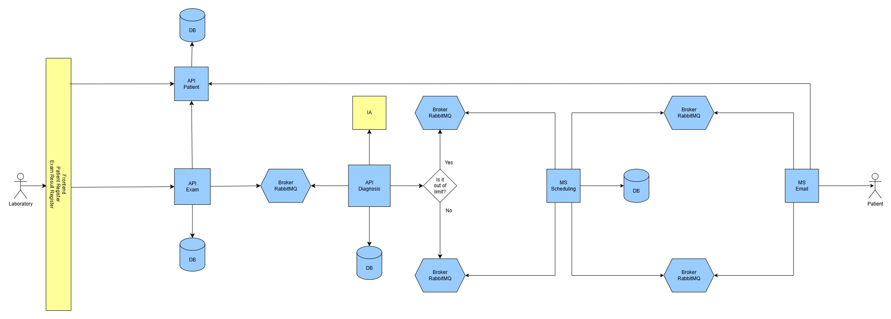

# Hackathon Fiap - Fase 5

# Pós Tech - Arquitetura e Desenvolvimento Java - Fiap - 2024/25

**Grupo 11:**

- **[Pedro Ono](https://github.com/pedr0no) - RM 354950**
- **[Elton Xavier Souza](https://github.com/eltonxs) - RM 354254**
- **[Welder Ressutti](https://github.com/welderessutti) - RM 354557**

# Glicare - Sistema de Gerenciamento de Resultado de Exame, Diagnóstico e Agendamento

## Microsserviços do Projeto

**🧑‍🦰 [API-Patient](https://github.com/welderessutti/api-patient)** |
**🧪 [API-Exam](https://github.com/eltonxs/diabetes-exam-management)** |
**🩺 [API-Diagnosis](https://github.com/welderessutti/api-diagnosis)** |
**📅 [MS-Scheduling](https://github.com/pedr0no/ms-medical-consultant-scheduler)** |
**📧 [MS-Email](https://github.com/welderessutti/ms-email)**

## Desafio

O tema do hackathon é **"Inovação para otimização de atendimento no SUS (Sistema Único de Saúde)"**.

O objetivo é desenvolver soluções tecnológicas que melhorem o atendimento à população e o trabalho dos profissionais de
saúde, promovendo maior eficiência, transparência e uma experiência aprimorada para **pacientes** e **colaboradores**.

A proposta visa resolver desafios enfrentados pelos sistemas de saúde, buscando inovações que impactem positivamente o
processo de cuidados médicos.

## Problema

O acompanhamento de pacientes com **diabetes** no SUS enfrenta desafios como falta de **monitoramento contínuo**,
**atrasos** no agendamento de **exames** e **consultas** e **sobrecarga** dos profissionais de saúde. Sem um sistema
eficiente, muitos pacientes deixam de realizar exames no tempo adequado, resultando em **diagnósticos tardios** e
**complicações evitáveis**.

Essa falta de acompanhamento adequado leva ao **agravamento** da doença, aumentando a necessidade de **internações**,
**tratamentos emergenciais** e **cirurgias**, originando um **custo adicional** significativo para o
**Governo Federal**.

## Solução

Nossa solução **Glicare** é um **Sistema de Gerenciamento de Resultado de Exame de Hemoglobina Glicada e
Agendamento** para pacientes diagnosticados com **diabetes**. O sistema utiliza **Inteligência Artificial (IA)** para
avaliar os resultados dos exames de hemoglobina glicada e determinar a ação necessária.

- **Avaliação do Exame:** A IA avalia os resultados dos exames e, dependendo do diagnóstico, o sistema toma decisões
  automatizadas.

- **Agendamento de Exames ou Consultas:** Caso o exame esteja dentro dos **limites normais**, é agendado automaticamente
  um **novo exame** para monitoramento. Caso o resultado esteja **alterado**, o sistema agenda uma **consulta médica**
  para acompanhamento e avaliação.

Essa solução proporciona um monitoramento mais preciso para pacientes **diabéticos**, ao mesmo tempo em que otimiza o
processo de **agendamento de exames** e **consultas**, resultando em maior eficiência no **atendimento** e no **controle
de saúde**.

Com a automação do processo de avaliação e agendamento, o sistema contribui para a redução de **falhas humanas** e para
o aprimoramento da experiência tanto dos **pacientes**, reduzindo o tempo de espera para agendamentos simples, quanto
dos **profissionais de saúde no SUS**, permitindo que foquem em procedimentos mais importantes. Isso torna o atendimento
mais ágil, acessível e eficiente.

_***Importante**: A funcionalidade de **IA** ainda **não foi implementada** neste MVP, mas faz parte do escopo do
sistema._

### Sobre a Hemoglobina Glicada (HbA1c)

O exame de **hemoglobina glicada (HbA1c)** é o principal teste utilizado para monitorar o controle do diabetes, pois
reflete a média dos níveis de glicose no sangue nos últimos **2 a 3 meses**. Diferente da glicemia de jejum, que mede a
glicose em um único momento, a HbA1c fornece uma visão mais abrangente do controle glicêmico do paciente.

#### Valores de referência da HbA1c:

✅ **Normal:** Abaixo de **5,7%**  
⚠️ **Pré-diabetes:** Entre **5,7% e 6,4%**  
❌ **Diabetes:** **6,5% ou mais**

#### Frequência recomendada do exame:

📆 **Pacientes com diabetes bem controlado:** A cada **6 meses**  
📆 **Pacientes com diabetes descompensado ou mudança de tratamento:** A cada **3 meses**

Esse exame é essencial para identificar padrões glicêmicos, ajustar tratamentos e reduzir complicações do diabetes a
longo prazo.

**Fonte: [Sociedade Brasileira de Diabetes](https://diretriz.diabetes.org.br/metas-no-tratamento-do-diabetes/)**

## Tecnologias

- **Java 17** – Linguagem de programação utilizada no desenvolvimento do sistema.
- **Spring Web** – Base para a construção das APIs RESTful do sistema.
- **Spring Data JPA** – Gerenciamento da persistência de dados e integração com o banco de dados.
- **PostgreSQL** – Banco de dados relacional utilizado para armazenar as informações do sistema.
- **Spring Cloud** – Conjunto de ferramentas para facilitar a arquitetura baseada em microsserviços.
- **Spring Cloud Stream** – Implementação de mensageria para comunicação assíncrona entre microsserviços via RabbitMQ.
- **RabbitMQ** – Message broker utilizado para integração assíncrona entre os microsserviços.
- **OpenFeign** – Cliente HTTP declarativo para facilitar a comunicação síncrona entre os microsserviços.
- **Spring Mail** – Módulo para envio de e-mails automáticos de notificações.
- **Flyway** – Controle de versionamento do banco de dados, garantindo migrações seguras.
- **Spring Validation** – Validação de dados recebidos nas requisições das APIs.
- **Swagger** – Documentação interativa das APIs para facilitar testes e integração.
- **Lombok** – Redução de boilerplate no código, simplificando a criação de classes Java.
- **API ViaCEP** – Serviço utilizado para buscar informações de endereços a partir do CEP, garantindo maior precisão e
  automação no cadastro de pacientes.
- **Docker** – Containerização dos microsserviços para facilitar o deploy e a escalabilidade.

## Arquitetura

Nosso sistema foi desenvolvido seguindo a **Arquitetura Hexagonal** em todas as APIs e microsserviços, garantindo um
design **modular, desacoplado e testável**. Além disso, utilizamos o padrão **RESTful** e os princípios **SOLID**,
para manter o código organizado, fácil de manter e expandir.

Optamos por uma **arquitetura baseada em microsserviços** para garantir **escalabilidade** e **resiliência** ao sistema:

- **Escalabilidade:** Cada microsserviço pode ser escalado individualmente conforme a demanda, otimizando o uso de
  recursos.

- **Resiliência:** A separação das responsabilidades evita que falhas em um serviço impactem todo o sistema, garantindo
  maior disponibilidade.

A comunicação entre os microsserviços combina **REST (síncrono)** e **mensageria com RabbitMQ (assíncrono)**, garantindo
**eficiência na troca de informações** e **baixo acoplamento** entre os serviços.

Essa abordagem permite um sistema **flexível, robusto e preparado para crescimento**, facilitando futuras integrações e
evoluções da solução.

A arquitetura desta aplicação foi desenvolvida da seguinte forma:



## Fluxo de Dados Entre os Microsserviços

O sistema segue um fluxo de comunicação **síncrona e assíncrona** para garantir eficiência e escalabilidade no
processamento dos dados dos pacientes e no gerenciamento de exames e consultas.

🧑‍🦰 **Cadastro do paciente** → 🧪 **Registro do exame** → 🩺 **Diagnóstico via IA** → 📅 **Agendamento automático** →
📧 **Notificação via e-mail**

1️⃣ **🧑‍🦰 [API-Patient](https://github.com/welderessutti/api-patient)**

- Recebe os dados do paciente e realiza o **cadastro** no sistema.
- Disponibiliza os dados do paciente para os demais microsserviços via **API REST**.

2️⃣ **🧪 [API-Exam](https://github.com/eltonxs/diabetes-exam-management)**

- Recebe o id do paciente e **registra o resultado do exame** de hemoglobina glicada.
- Envia uma **mensagem para o broker (RabbitMQ)** com as informações do exame.

3️⃣ **🩺 [API-Diagnosis](https://github.com/welderessutti/api-diagnosis)**

- Consome a mensagem do **broker** contendo o resultado do exame.
- Aplica as **regras de negócio** com auxílio da **IA** para determinar se o resultado está **normal** ou **alterado**.
- Registra o diagnóstico e **envia uma nova mensagem** para o broker com essa informação.

4️⃣ **📅 [MS-Scheduling](https://github.com/pedr0no/ms-medical-consultant-scheduler)**

- Escuta mensagens no **canal de agendamento de exame** e no **canal de agendamento de consulta**.
- Realiza o agendamento do **exame** ou **consulta**.
- Após o agendamento, envia uma **mensagem para o broker** com os detalhes.

5️⃣ **📧 [MS-Email](https://github.com/welderessutti/ms-email)**

- Escuta as mensagens do broker sobre **agendamentos de exames e consultas**.
- Faz um **GET na API-Patient** para obter os dados do paciente **(nome e e-mail)**.
- **Gera e envia um e-mail** informando o paciente sobre o agendamento.

## Executando a aplicação

Cada aplicação possui sua imagem hospedada no [Docker Hub](https://hub.docker.com/repositories/welderessutti).

Utilizamos Docker Compose para orquestrar todos os microsserviços, APIs, bancos de dados e o broker RabbitMQ em
containers isolados, garantindo um ambiente padronizado e de fácil execução.

- **Health Check:** Cada serviço possui verificações automáticas para garantir que está saudável antes de ser utilizado.
- **Dependências:** Os serviços são iniciados na ordem correta, respeitando as dependências entre APIs, bancos de dados
  e mensageria.
- **Rede Personalizada:** Criamos uma rede interna no Docker para que os microsserviços se comuniquem de forma segura e
  eficiente.

### Pré-requisitos

- **Git** (caso queira clonar o repositório, mas você pode apenas baixá-lo):
    - [Git](https://git-scm.com/downloads)
- **Docker Desktop** (para executar a aplicação através de containers):
    - [Docker](https://www.docker.com/products/docker-desktop/)

### Passo 1: Clonar ou baixar o repositório

Para clonar o repositório, use o comando:

```bash
git clone https://github.com/welderessutti/hackathon-fiap-glicare.git
```

Caso não queira clonar o repositório, você pode baixá-lo
em [GitHub](https://github.com/welderessutti/hackathon-fiap-glicare).

### Passo 2: Executar a aplicação com Docker

No terminal, dentro do diretório raíz do projeto (local onde se encontra o arquivo **compose.yaml** da aplicação),
execute o comando abaixo para subir todos os containers da aplicação:

_***Atenção**: Antes de executar o comando, você deve trocar os valores das variáveis de
ambiente **SPRING_MAIL_USERNAME** e **SPRING_MAIL_PASSWORD** para os valores do seu serviço de envio de email._

#### Windows (PowerShell)

```powershell
$env:SPRING_MAIL_USERNAME="SEU_EMAIL"; $env:SPRING_MAIL_PASSWORD="SUA_SENHA"; docker compose up -d
```

#### Windows (CMD)

```cmd
set SPRING_MAIL_USERNAME=SEU_EMAIL
```

```cmd
set SPRING_MAIL_PASSWORD=SUA_SENHA
```

```cmd
docker compose up -d
```

#### Linux ou macOS (Bash)

```bash
SPRING_MAIL_USERNAME="SEU_EMAIL" SPRING_MAIL_PASSWORD="SUA_SENHA" docker compose up -d
```

## Serviços e Portas

Após subir os containers com `docker compose up -d`, use os endereços abaixo para acessar os serviços:

| Serviço                      | Tipo          | Porta/Endereço de Acesso       |
|------------------------------|---------------|--------------------------------|
| **API Patient**              | Microsserviço | `http://localhost:8080`        |
| **Banco de Dados Patient**   | PostgreSQL    | `localhost:5432/patient`       |
| **API Exam**                 | Microsserviço | `http://localhost:8081`        |
| **Banco de Dados Exam**      | PostgreSQL    | `localhost:5433/diabetes_exam` |
| **API Diagnosis**            | Microsserviço | `http://localhost:8082`        |
| **Banco de Dados Diagnosis** | PostgreSQL    | `localhost:5434/diagnosis`     |
| **MS Scheduling**            | Microsserviço | *Se comunica via RabbitMQ*     |
| **MS Email**                 | Microsserviço | *Se comunica via RabbitMQ*     |
| **RabbitMQ**                 | Mensageria    | `localhost:5672`               |
| **Painel RabbitMQ**          | Dashboard     | `http://localhost:15672`       |

## Coleções de API (Postman/Insomnia)

As coleções de requisições do Postman e Insomnia estão disponíveis no diretório `api-requests/`

Se você deseja testar os endpoints da API, basta importar os arquivos de coleção no Postman ou Insomnia e executar as
requisições conforme necessário.
